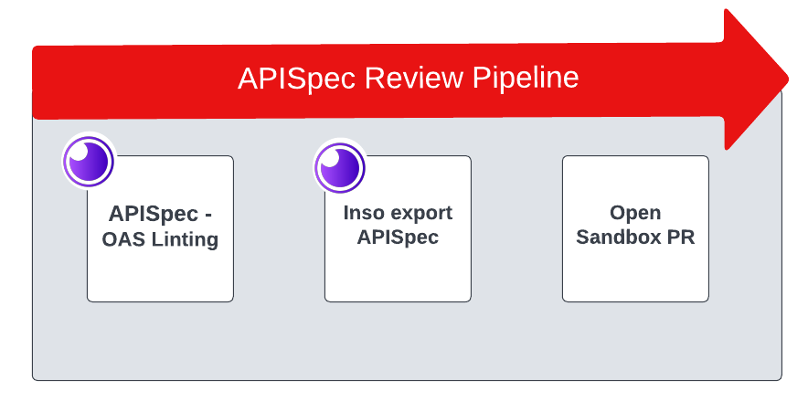
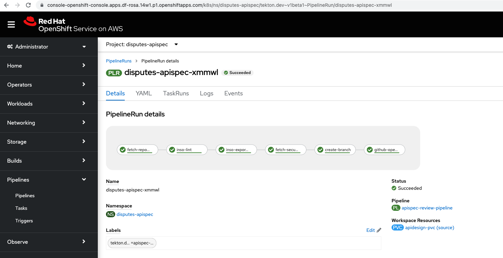
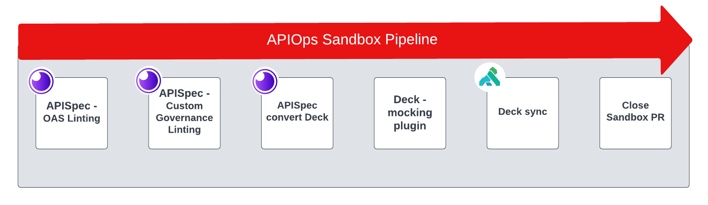
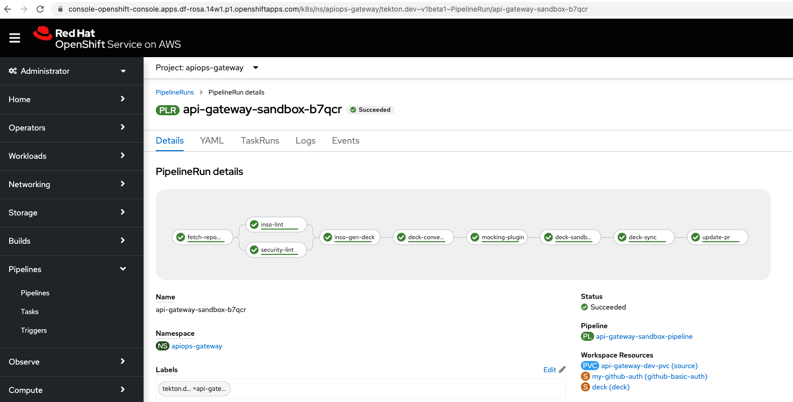
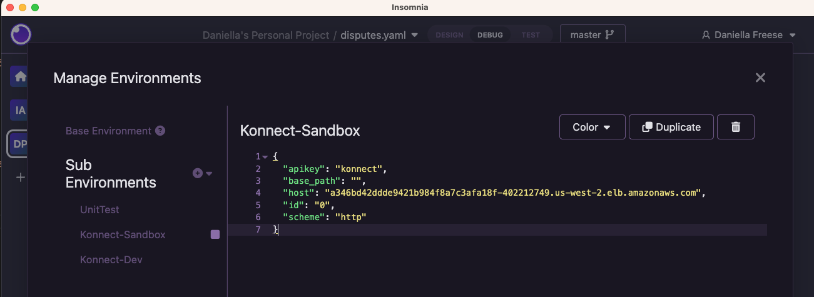
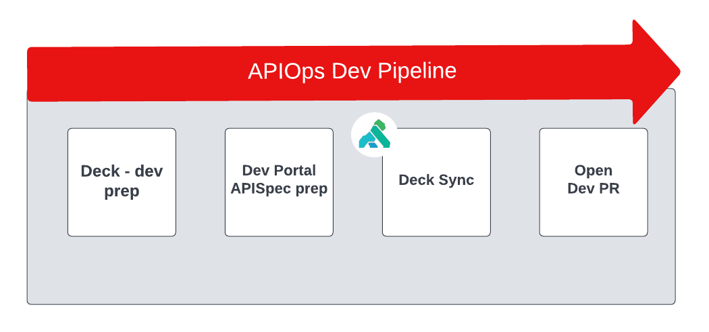
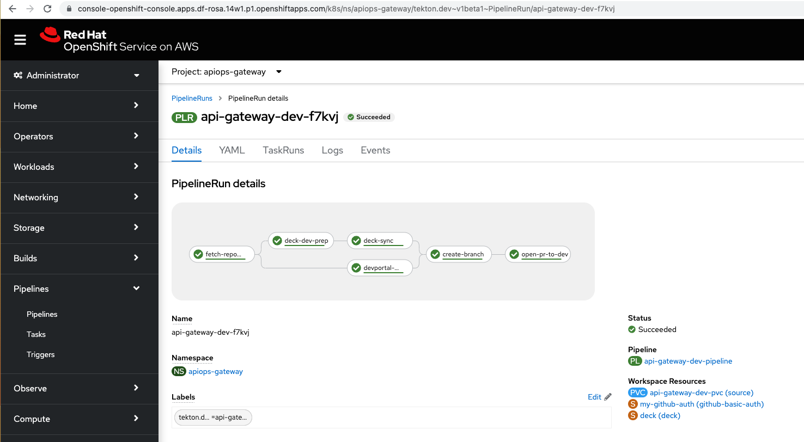

# APISecOps - Insomnia, Kong Konnect, Tekton - on ROSA

<p align="center">
  </div>
</p>

## Table of Contents

<!-- @import "[TOC]" {cmd="toc" depthFrom=2 depthTo=6 orderedList=true} -->

<!-- code_chunk_output -->

1. [Table of Contents](#table-of-contents)
2. [Introduction](#introduction)
3. [Prerequisites](#prequisites)
4. [TutorialOverview](#tutorial-overview)
    1. [AcmeBank Disputes APISpec](#acmebank-disputes-apispec)
    2. [Infrastructure](#infrastructure)
5. [Getting Started](#getting-started)
    1. [Download Git Repo](#download-git-repo)
    2. [ROSA](#rosa)
    3. [Ansible](#ansible)
6. [Devops Tutorial](#tutorial-overview)
    1. [API Design](#1-api-design---update-the-apispec-in-insomnia)
    2. [Review Pipeline](#2-submit-the-apispec-for-review)
    3. [Sandbox Pipeline](#3-governance-review-and-publish-api-to-konnect-sandbox-gateway-environment)
    4. [Dev Pipeline](#4-publish-api-to-konnect-dev-gateway-environment)
7. [Cleanup](#cleanup)
8. [Project Directory Overview](#project-directory-overview)
9. [References and Links](#references)
10. [License](#license)

<!-- /code_chunk_output -->

## Introduction

APISecOps stands for API design, security, and operations. Here at Kong APISecOps centers around four core fundmentals:

* **Centralization** - Centralize API Management to a single control plane. Irrespective of cloud provider, or platform, all APIs can be managed from the same control plane.

* **Governance** - A governance team should be able easily customize API linting for security concerns and quickly validate.

* **API Design First** - Development Teams should design and document the API upfront to validate they are update to date with current governance requirements, and accurate documentation.

* **GitOps** - The API Spec, supporting documentation, governance, and API administration should all be handled via gitops best practices for speed, reslience, and reliablity in the process.

The objective of this demo is to showcase how to streamline Kong API management with the above APISecOps best practices in mind with Kong in the Red Hat Openshift Ecosystem. We will step through the responsibilities of the three personas, Development, Governance and Operations Teams, and the automation of these personas with Openshift Pipelines - Red Hat’s cloud-native CI/CD solution.


**Development Team** - The responsiblity of the Development Team is to Design the API in Insomnia Desktop Application upfront taking into account both the product requirements and governance requirements. With the inso cli tooling, the team can also lint the spec before committing the spec to source control.

**Governance Team** - The responsibility of the Governance Team is to build out custom security rules that align with the organizations standards. These rules are then executed during the CI/CD pipeline to evaluate if new or updating APIs comply.

**Operations Team** - The operations team will have tasks in the CI/CD pipeline to convert the APISpec to a kong deck configuration file (inso cli), validates the deck meets the operational requirements, and sync the deck configuration (deck cli) to the Konnect control plane.

These three activities as shown in the diagram above will be automated end-2-end  through gitops and CI/CD best practices.

## Prequisites

1. **Openshift Cluster** - This demo will step through the rosa cli command to create a ROSA cluster but any OpenShift cluster will suffice. This demo has been tested on OCP 4.11.

2. **Ansible Core >= 2.13** - The playbooks have been tested on 2.13.5 and python version 3.10.8. More information can be found at [Installing Ansible][Ansible_Install_Distros].

3. **Kong Konnect Plus Account** - The demo requires and *Konnect Plus* grade account because 2 runtime groups and several enterprise grade plugins are used. For more information please review the [Kong Konnect Pricing Plan][Konnect_Pricing].

4. **Insomnia** - To download check out [Insomnia Download][Insomnia_Install].

5. **oc cli** - The binary download can be found in the openshift console, in the ? tab on the top.

6. **Helm 3 cli** - Follow the helm documentation to install the binary [Helm Install][Helm_Install]

## Tutorial Overview

### AcmeBank Disputes APISpec

For this tutorial you will be working on the Acmebank Disputes APISpec.

**First**, you will get hands-on-experiences with Insomnia. The Disputes APISpec will be imported, updated, and the changes commited to source control all from Insomnia.

**Second**, once the APISpec has been commited to source control, you will execute three tekton CI/CD pipelines sequentially, to review and publish the API to the appropriate Gateway Environment.

1. **disputes-apispec-review pipeline** - will open a pr to push the APISpec to the konnect-sandbox runtime group.
2. **api-gateway-sandbox-pipeline** - will review open prs to konnect-sandbox: execute custom governance linting of the APISpec, validate the deck transformation, and finally deck sync to administer the API to to the konnect-sandbox runtime group.
3. **api-gatway-dev-pipeline** - will publish the APISpec to konnect-dev runtime group and Konnect Service Hub for Dev Portal Integration.

The diagram below summarizes the steps described above and aligns the pipelines to the Konnect Infrastructure.


*Note - just to clarify this demo is run within 1 cluster, but in order to clearly depict the tekton pipeline ci/cd and the infra it is depicted as two. It's really just all in the same cluster.*

### Infrastructure

**Konnect**

Two Runtime Groups will be either created or at least checked that it exists - Default, and Dev.

Each runtime group will be provisioned 1 runtime instance (also referred to as a Gateway, Dataplane, or Proxy), each one will be in their own namespace, kong-sandbox, and kong-dev. These Gateways are exposed via loadbalancers, and are where API Consumers can call the protected backend services.

**Openshift Pipelines/Tekton**

The three pipelines to be executed will be in the namespaces `disputes-apispec` and `apiops-gateway` namespaces respectively. The seperation between namespaces is demonstrate how pipelines belonging to different personas (Dev Teams vs. Governance and API Operator teams) can be managed in a more secure fashion.

**Gitea (Self-hosted Git service)**

Gitea is a self-hosted Git service. It is stood up in the cluster in the `gitea` namespace. Two the git repos required to run the demo are imported, and any dummy passwords needed for the demo are seeded in the projects and provided to the user. Details on the two repositories:

* `acmebank-disputes-apispec`: Contains the `.insomnia` design disputes API Design doc.
* `acmebank-apiops-gateway`: Contains the governance rules, deck and apispec files version controlled.

**Disputes Sample Application**

The sample application is deployed in `disputes-dev` namespace. It is a very small JBoss EAP application server.

## Getting Started

### Download Git Repo

Download this repository to your workstation:

```console
git clone https://github.com/Kong/kong-apisecops-redhat.git
```

### ROSA

Create System Variables:

```console
CLUSTER_NAME=<my-cluster-name>
REGION=<my-aws-region>
```

Create a small ROSA cluster:

```console
rosa create cluster --cluster-name=$CLUSTER_NAME --region=$REGION --multi-az=false --compute-machine-type=t3.xlarge
```

When the Cluster install is complete, create a cluster-admin user:

```console
rosa create admin --cluster $CLUSTER_NAME
```

Validate you can login to the cluster via the credentials provided by the rosa cli stdout. Once login is successful you can proceed to the next step.

### Ansible

**Ansible prerequisites**

Install ansible collections required by the playbook:

```console
ansible-galaxy install -r ansible/requirements.yml
```

**ROSA and Konnect Configuration**

Execute the install ansible playbook. The play will do the following:

* **Cert Manager Operator** - install and create Konnect DP self-signed certs
* **Openshift Pipelines Operator** - install
* **Gitea** - install and configure
* **Konnect**
  * create and/or configure runtime groups (Default and Dev)
  * create konnect gateways (runtime instances)
* **APIOps** - create namespaces, install tekton pipelines and create tekton pipelineruns
* **Disputes Sample App** - create namespace and deploy

```console
ansible-playbook ansible/playbook.yaml --extra-vars "konnect_email=<yourEmail> konnect_pass=<yourPassword>"
```

Any required information, urls, dummy passwords, load balancers, are spit out as the last task in the ansible playbook, and saved in the `ansible/demo_facts.json` file for safe keeping.

## Devops Tutorial

### 1. API Design - Update the APISpec in Insomnia

**Import the APISpec**

* Copy the `gitea url`, located in ansible/demo_facts.json to your clipboard.

* Copy gitea `acmebank-disputes-apispec` HTTP url to your clipboard
  * In the browser navigate to the gitea url, trust the certificate (it is a self-signed cert provisioned by the Openshift CA).
  * Login with username, password `gitea` and `openshift`.
  * Navigate to `acmebank-disputes-apispec` repository.
  * Copy the HTTP repo url.

* Import APISpec in Insomnia Desktop Application
  * Open Insomnia on the Desktop.
  * Within your Personal Project Select `Import From`
  * In the dropdown select `Git Clone`.
  * The `Configure Repository` Window will open.

* In the `Configure Repository`, fill in the following details:
  * **Git URI** - url to acmebank-disputes-apispec in your clipboard (example: `http://gitea-gitea.apps.df-rosa.14w1.p1.openshiftapps.com/gitea/acmebank-disputes-apispec.git`)
  * **Author Name** - apisecops-demo
  * **Author Email** - apisecops@demo-example.com
  * **Username** - gitea
  * **Authentication Token** - openshift

Within your Insomnia Project you should now see 1 design document, `disputes.yaml`. Open the document to make corrections.

**Fix OAS Linting Concerns**

1. `line 2 - info object must have "contact" object` Copy the following to the info object:

```console
    contact: 
        name: "AcmeBank Disputes Team"
        url: "http://disputes-acmebank.com/support"
        email: "disputes-support@acmebank.com"
```

2. `line 25 - Operation "description" must be present and non-empty string` This is pertaining to the /disputes.get.operation object. To the object add the `description` field and string as show below:

```console
    operationId: "getListDispute"
    description: "Returns a list of Disputes"
    summary: Return a list of disputes
```

3. `line 62 - Operation "description" must be present and non-empty string` This again is the same error as above, but to the /disputes/{id}.get.operation object.

To the object add the `description` field and string as show below:

```console
      operationId: "getDispute"
      ...
      description: "Return a dispute by id"
      summary: Return a dispute by id.
```

**Commit and Push Changes**

You will now commit and push the changes made to the APISpec back up to it's gitea repository.

* Select the branch button `master`.
* In the dropdown select `commit`, provide a commit message.
* Then select `push`.

The changes have now been committed to the master branch. Navigate to the gitea repo and validate the changes have been comitted.

### 2. Submit the APISpec for Review

This step is for the **Developer Persona**

Once the APISpec is ready to review,  the disputes-apispec-review pipeline will be executed. This pipeline will:

* Export the apispec from the .insomnia repo structure
* Standard OAS linting
* Create the pr for the konnect-sandbox env.

The order of events and kong tooling to be used in the tekton pipeline is highlighted in the diagram below:



From the cli, execute the first pipeline:

```console
oc create -f run/disputes-pipeline-run.yaml
```

To view and validate the pipeline is running, navigate to the `disputes-apispec` project, and in the Pipeline Tab. A screenshot is below:



### 3. Governance Review and Publish API to Konnect-Sandbox Gateway Environment

**Publish API to Sandbox Gateway Env**

This step is for the **Governance and Operations Personas**

Now that PR is open on the apiops-gateway gitea repo, the sandbox pipeline can be executed. This pipeline will:

* Execute standard OAS linting.
* Execute custom governance linting rules.
* Create the deck config from the apispec.
* Add the mocking plugin to the apispec.
* Deck sync to the Konnect Control Plane.

The order of events and kong tooling to be used in the tekton pipeline is highlighted in the diagram below:



Execute Pipeline 2:

```console
oc create -f run/apiops-sandbox-pipeline-run.yaml
```

To view and validate the pipeline is running, navigate to the `apiops-gateway` project, and in the Pipeline Tab. A screenshot is below:



Once this Pipeline has run, navigate to the `apiops-gateway` gitea repo, and approve the pr opened on the `sandbox` branch.

**Validation**

Now that the API spec has been synced/published to the Konnect control plane you can validate via Insomnia that the gateway is exposing the API's correctly.

For the sandbox environment, keep in mind the `mocking` plugin was used so all data being return is not hitting an actual backend service. This was done intentionally to showcase how even in the case of APIops we can support external teams to testdrive new or updating APIs while the development teams build out the backend service.

* Open the disputes design document in Insomnia.
* In the bottom right corner select `Generate Request Collection`. This will drop you into the `Debug` Tab where you can execute API Requests.
* Add the Konnect-Sandbox and Konnect-Dev Environment Details inorder to properly reach the API Gateways.
  * In the top left tab select the dropdown menu where it says `OpenAPI env sandbox:8080`
  * Select `Manage Environments`
  * Create a new Sub-Environment, `Konnect-Sandbox`
    * Paste in the konnect sandbox details, located in the ansible/demo_facts.json file.
    * The screenshot below shows what the Konnect-Sandbox Env should look like.



With the environments setup in the Insomnia workspace, you can now hit the sandbox gateway and review the responses being generated by the mocking plugin.

### 4. Publish API to Konnect-Dev Gateway Environment

**Publish API to Dev Gateway Env**

This pipeline is for the **Operations Personas**

The development team has deployed the disputes microservice to its dev environment, and now ready to allow others to consume the API, this means publishing the API to the konnect dev gateway instances and document the API Service Hub. This pipeline will:

* Prepare deck config for dev environment.
* Add the Service Hub tag to the deck config.
* Prepare a APISpec for the Dev Portal
  * Remove any plugin references
  * Correct the server reference to point at the konnect-dev gateway loadbalancer
* Deck sync to the Konnect Control Plane.

The order of events and kong tooling to be used in the tekton pipeline is highlighted in the diagram below:



Execute Pipeline 3:

```console
oc create -f run/apiops-dev-pipeline-run.yaml
```

To view and validate the pipeline is running, navigate to the `apiops-gateway` project, and in the Pipeline Tab. A screenshot is below:



**Validation**

Now that the API spec has been synced/published to the Konnect control plane you can validate via Insomnia that the gateway is exposing the API's correctly.

For the dev environment, the gatey configuration has been setup to proxy requests to the dispute microservice running in the `disputes-dev` namespace.

* Open the `Debug` Tab in Insomnia
* Change to the `Konnect-Dev` Environment
* Execute the disputes requests to validate the behavior. You should see new responses, and possibly a 404 on /disputes/{id} (because it's in Dev and still in testing 😆).

## Cleanup

**Kong**ratulations on completing the workshop! Now its time to delete the infrastructure you’ve created in order to work through the material.

**Delete Konnect Gateways**

Run the unistall playbook to tear down the konnect gateways deployed on the cluster:

```console
ansible-playbook ansible/playbook-uninstall.yaml
```

**Delete ROSA Cluster**

Delete the ROSA cluster-admin user:

```console
rosa delete admin --cluster $CLUSTER_NAME
```

Delete ROSA cluster:

```console
rosa delete cluster --cluster $CLUSTER_NAME
```

## Project Directory Overview

```console
├── README.md 
├── ansible                           <-- ansible scripts
│   ├── disputes
│   ├── playbook-uninstall.yaml
│   ├── playbook.yaml
│   ├── tasks
│   └── vars
├── konnect                           <-- konnect deck configuration, backup just in case need to re-align konnect runtime group configuration
│   ├── deck-default-rg.yaml
│   ├── ...
│   └── deck-disputes-dev-rg.yaml
└── run                               <-- tekton pipeline runs
    ├── apiops-dev-pipeline-run.yaml
    ├── apiops-sandbox-pipeline-run.yaml
    └── disputes-pipeline-run.yaml
```

## References

* [Kong Konnect Pricing Plan][Konnect_Pricing]
* [Installing Ansible][Ansible_Install_Distros]
* [Rosa Quickstart Guide][Rosa_Docs]
* [Install Insomnia][Insomnia_Install]

    [list of links]: #

[Konnect_Pricing]: https://konghq.com/pricing
[Ansible_Install_Distros]: https://docs.ansible.com/ansible/latest/installation_guide/installation_distros.html
[Rosa_Docs]: https://docs.openshift.com/rosa/rosa_getting_started/rosa-quickstart-guide-ui.html
[Insomnia_Install]: https://insomnia.rest/download
[Helm_Install]: https://helm.sh/docs/intro/install

## License

[Apache 2.0](LICENSE)