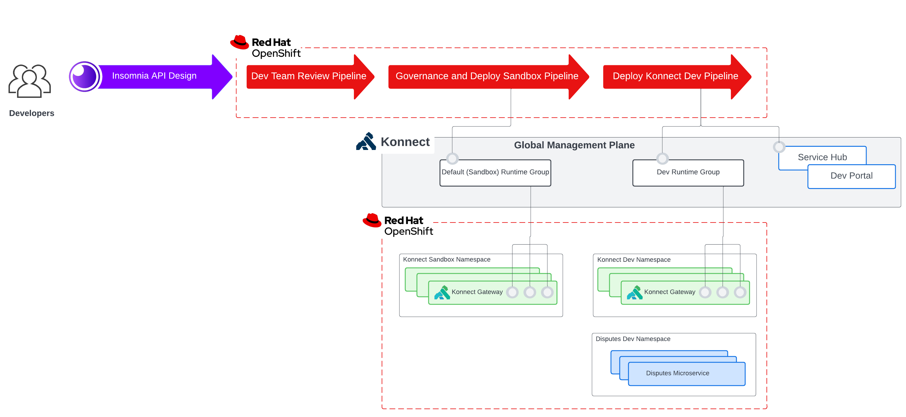

# APISecOps - Insomnia, Kong Konnect, Tekton - on ROSA

APISecOps stands for API design, security, and operations. Here at Kong APISecOps centers around four core fundmentals:

* **Centralization** - Centralize API Management to a single control plane. Irrespective of cloud provider, or platform, all APIs can be managed from the same control plane.

* **Governance** - A governance team should be able easily customize API linting for security concerns and quickly validate.

* **API Design First** - Development Teams should design and document the API upfront to validate they are update to date with current governance requirements, and accurate documentation.

* **GitOps** - The API Spec, supporting documentation, governance, and API administrative should all be handled via gitops best practices for speed, reslience, and reliablity in the process.

The objective of this demo is to showcase how to streamline Kong API management with the above APISecOps best practices in mind with Kong in the Red Hat Openshift Ecosystem. We will step through the responsibilities of the three personas, Development, Governance and Operations Teams, and the automation of these personas with Openshift Pipelines - Red Hat’s cloud-native CI/CD solution.


**Development Team** - The responsiblity of the Development Team is to Design the API in Insomnia Desktop Application upfront taking into account both the product requirements and governance requirements. With the inso cli tooling, the team can also lint the spec before committing the spec to source control.

**Governance Team** - The responsibility of the Governance Team is to build out custom security rules that align with the organizations standards. These rules are then executed during the CI/CD pipeline to regularly evaluate new or updating APIs.

**Operations Team** - The operations team will have tasks in the CI/CD pipeline to convert the APISpec to a kong deck configuration file (inso cli), meets the env requirements, and sync the deck configuration (deck cli) to the Konnect control plane.

These three activities as shown in the diagram above will be managed through end-2-end gitops practices.

## Prequisites

1. **Openshift Cluster** - This demo will step through the rosa cli command to create a ROSA cluster but any OpenShift cluster will suffice. This demo has been tested on OCP 4.11.

2. **Ansible Core >= 2.13** - The playbooks have been tested on 2.13.5 and python version 3.10.8. More information can be found at [Installing Ansible][Ansible_Install_Distros].

3. **Kong Konnect Plus Account** - The demo requires and *Konnect Plus* grade account because 2 runtime groups and several enterprise grade plugins are used. For more information please review the [Kong Konnect Pricing Plan][Konnect_Pricing].

4. **Insomnia** - To download check out [Insomnia Download][Insomnia_Install].

## Tutorial Overview

### AcmeBank Disputes APISpec

For this tutorial you will be working on the Acmebank Disputes APISpec.

**First**, you will get hands-on-experiences with Insomnia. The Disputes APISpec will be imported, updated, and the changes commited to source control all from Insomnia.

**Second**, once the APISpec has been commited to source control, you will execute three tekton CI/CD pipelines sequentially, to review and publish the API to the appropriate Gateway Environment.

1. **disputes-apispec-review pipeline** - will open a pr to push the APISpec to the konnect-sandbox runtime group.
2. **api-gateway-sandbox-pipeline** - will review open prs to konnect-sandbox: execute custom governance linting of the APISpec, validate the deck transformation, and finally deck sync to administer the API to to the konnect-sandbox runtime group.
3. **api-gatway-dev-pipeline** - will publish the APISpec to konnect-dev runtime group and Konnect Service Hub for Dev Portal Integration.

The diagram below summarizes the steps described above and aligns the pipelines to the Konnect Infrastructure.



*Note - just to clarify this demo is run within 1 cluster, but in order to clearly depict the tekton pipeline ci/cd and the infra it is depicted as two. It's really just all in the same cluster.*

### Infrastructure

**Konnect**

Two Runtime Groups will be either created or at least checked that it exists - Default, and Dev.

Each runtime group will be provisioned 1 runtime instance (also referred to as a Gateway, Dataplane, or Proxy), each one will be in their own namespace, kong-sandbox, and kong-dev. These Gateways are exposed via loadbalancers, and are where API Consumers can call the protected backend services.

**Openshift Pipelines/Tekton**

The three pipelines to be executed will be in the namespaces `disputes-apispec` and `apiops-gateway` namespaces respectively. The seperation between namespaces is demonstrate how pipelines belonging to different personas (Dev Teams vs. Governance and API Operator teams) can be managed in a more secure fashion.

**Gitea (Self-hosted Git service)**

Gitea is a self-hosted Git service. It is stood up in the cluster in the `gitea` namespace. Two the git repos required to run the demo are imported, and any dummy passwords needed for the demo are seeded in the projects and provided to the user. Details on the two repositories:

`acmeback-disputes-apispec`: Contains the `.insomnia` design disputes API Design doc.

**Disputes Sample Application**

The sample application is deployed in `disputes-dev` namespace. It is a very small JBoss EAP application server.

## Deploy Infrastructure

### ROSA

Create System Variables:

```console
CLUSTER_NAME=<my-cluster-name>
REGION=<my-aws-region>
```

Create a small ROSA cluster:

```console
rosa create cluster --cluster-name=$CLUSTER_NAME --region=$REGION --multi-az=false --compute-machine-type=t3.xlarge
```

When the Cluster install is complete, create a cluster-admin user:

```console
rosa create admin --cluster $CLUSTER_NAME
```

Validate you can login to the cluster via the credentials provided by the rosa cli stdout. Once login is successful you can proceed to the next step.

### ROSA and Konnect Configuration

Execute the install ansible playbook. The play will do the following:

* **Cert Manager Operator** - install and create Konnect DP self-signed certs
* **Openshift Pipelines Operator** - install
* **Gitea** - install and configure
* **Konnect**
  * create and/or configure runtime groups (Default and Dev)
  * create konnect gateways (runtime instances)
* **APIOps** - create namespaces, install tekton pipelines and create tekton pipelineruns
* **Disputes Sample App** - create namespace and deploy

```console
ansible-playbook ansible/playbook.yaml --extra-vars "konnect_email=<yourEmail> konnect_pass=<yourPassword>"
```

Any required information, urls, dummy passwords, load balancers, are spit out as the last task in the ansible playbook, and saved in the `ansible/demo_facts.json` file for safe keeping.

## Devops Tutorial

### Step 1 - Update the APISpec in Insomnia

**Import the APISpec**

i. Copy the gitea url, located in ansible/demo_facts.json to your clipboard.

ii. In the browser navigate to gitea url --> trust the certificate, it is a self-signed cert provisioned by the Openshift CA --> login with username, password gitea and openshift --> navigate to `acmebank-disputes-apispec` --> select `copy` to copy HTTP repo url.

Open Insomnia --> Within your Personal Project Select `Import From` --> in the dropdown select `Git Clone` --> a `Configure Repository` Window will open.

In `Configure Repository` --> Select the `Git` Tab --> Fill in the following details:

* **Git URI** - url to acmebank-disputes-apispec in your clipboard (example: `http://gitea-gitea.apps.df-rosa.14w1.p1.openshiftapps.com/gitea/acmebank-disputes-apispec.git`)

* **Author Name** - apisecops-demo
* **Author Email** - apisecops@demo-example.com
* **Username** - gitea
* **Authenticatino Token** - openshift

Within your Insomnia Project you should see 1 design document, `disputes.yaml`. Open the document to make corrections.

**Fix OAS Linting Concerns**


1. `line 2 - info object must have "contact" object` Copy the following to the info object:

```console
    contact: 
        name: "AcmeBank Disputes Team"
        url: "http://disputes-acmebank.com/support"
        email: "disputes-support@acmebank.com"
```

2. `line 25 - Operation "description" must be present and non-empty string` This is pertaining to the /disputes.get.operation object. To the object add the `description` field and string as show below:

```console
    operationId: "getListDispute"
    description: "Returns a list of Disputes"
    summary: Return a list of disputes
```

3. `line 62 - Operation "description" must be present and non-empty string` This again is the same error as above, but to the /disputes/{id}.get.operation object. 

To the object add the `description` field and string as show below:

```console
      operationId: "getDispute"
      ...
      description: "Return a dispute by id"
      summary: Return a dispute by id.
```

**Commit and Push Changes**

At the top of the document, you will see a button `master` that reflects the branch you are working on, in this case the master branch. Select the button, in the dropdown select `commit` --> then select `push`. The changes have now been committed to the master branch.

### Step 2 - Submit the APISpec for Review

This step is for the **Dev Persona**.

Once the APISpec is ready to review,  the disputes-apispec-review pipeline will be executed. This pipeline will:

* export the apispec from the .insomnia repo structure
* standard OAS linting
* create the pr for the konnect-sandbox env.


Execute Pipeline 1:

```console
oc create -f run/disputes-pipeline-run.yaml
```

### Step 3

APIOps Persona - automatically validate the new apispec, and deploy to sandbox for teams to begin discovering and developing aginst

Execute Pipeline 2:

```console
oc create -f run/apiops-sandbox-pipeline-run.yaml
```

As an APIOps Person - I will have a PR approval process protecting my branches. In the case of the demo an APIOperator will manually merge in the pr.

### Step 4

Dev Persona - I am ready to let teams test the working API, I will deploy the dev, and request security to deploy the api to dev.

Execute Pipeline 3:

```console
oc create -f run/apiops-dev-pipeline-run.yaml
```

## Project Directory Overview

```console
├── README.md 
├── ansible                           <-- ansible scripts
│   ├── disputes
│   ├── playbook-uninstall.yaml
│   ├── playbook.yaml
│   ├── tasks
│   └── vars
├── konnect                           <-- konnect deck configuration, backup just in case need to re-align konnect runtime group configuration
│   ├── deck-default-rg.yaml
│   ├── ...
│   └── deck-disputes-dev-rg.yaml
└── run                               <-- tekton pipeline runs
    ├── apiops-dev-pipeline-run.yaml
    ├── apiops-sandbox-pipeline-run.yaml
    └── disputes-pipeline-run.yaml
```

## References

* [Kong Konnect Pricing Plan][Konnect_Pricing]
* [Installing Ansible][Ansible_Install_Distros]
* [Rosa Quickstart Guide][Rosa_Docs]
* [Install Insomnia][Insomnia_Install]

    [list of links]: #

[Konnect_Pricing]: https://konghq.com/pricing
[Ansible_Install_Distros]: https://docs.ansible.com/ansible/latest/installation_guide/installation_distros.html
[Rosa_Docs]: https://docs.openshift.com/rosa/rosa_getting_started/rosa-quickstart-guide-ui.html
[Insomnia_Install]: https://insomnia.rest/download